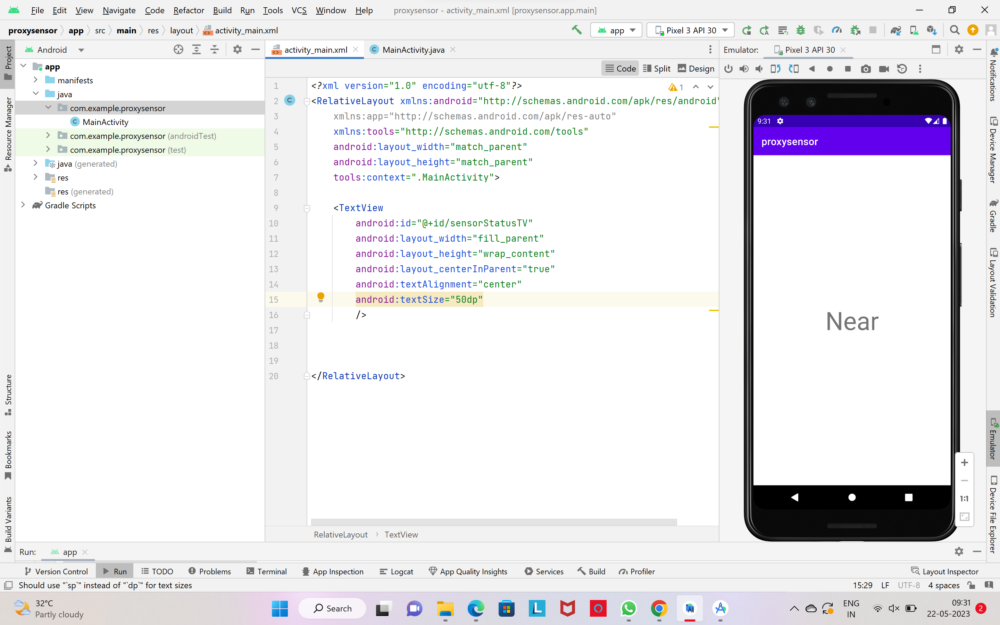

# Ex.No:5 Develop a simple application for proximity sensor using Sensor Manager in android studio.


## AIM:

To develop a sensor application for proximity sensor using sensor manager in Android Studio.

## EQUIPMENTS REQUIRED:

Android Studio(Min.required Artic Fox)

## ALGORITHM:

Step 1: Open Android Stdio and then click on File -> New -> New project.

Step 2: Then type the Application name as proximitysensor and click Next. 

Step 3: Then select the Minimum SDK as shown below and click Next.

Step 4: Then select the Empty Activity and click Next. Finally click Finish.

Step 5: Design layout in activity_main.xml.

Step 6: Display process of proximitysensor in android mobile devices.

Step 7: Save and run the application.

## PROGRAM:
```
/*
Program to print the process of proximitysensor in android mobile devices”.
Developed by: M.vivek reddy
Registeration Number : 212221240030
*/
```
## Main Activity.java
```
package com.example.proxysensor;

import androidx.appcompat.app.AppCompatActivity;

import android.content.Context;
import android.hardware.Sensor;
import android.hardware.SensorEvent;
import android.hardware.SensorEventListener;
import android.hardware.SensorManager;
import android.os.Bundle;
import android.widget.TextView;
import android.widget.Toast;

public class MainActivity extends AppCompatActivity {
    TextView sensorStatusTV;
    SensorManager sensorManager;
    Sensor proximitySensor;

    @Override
    protected void onCreate(Bundle savedInstanceState) {
        super.onCreate(savedInstanceState);
        setContentView(R.layout.activity_main);
        sensorStatusTV = findViewById(R.id.sensorStatusTV);
        sensorManager = (SensorManager) getSystemService(Context.SENSOR_SERVICE);
        proximitySensor = sensorManager.getDefaultSensor(Sensor.TYPE_PROXIMITY);
        if (proximitySensor == null) {
            Toast.makeText(this, "No proximity sensor found in device.", Toast.LENGTH_SHORT).show();
            finish();
        } else {
            Toast.makeText(this, "Proximity sensor is found", Toast.LENGTH_LONG).show();
            sensorManager.registerListener(proximitySensorEventListener,
                    proximitySensor,
                    SensorManager.SENSOR_DELAY_NORMAL);
        }
    }

    SensorEventListener proximitySensorEventListener = new SensorEventListener() {
        @Override
        public void onAccuracyChanged(Sensor sensor, int accuracy) {
        }

        @Override
        public void onSensorChanged(SensorEvent event) {
            if (event.sensor.getType() == Sensor.TYPE_PROXIMITY) {
                if (event.values[0] == 0) {
                    sensorStatusTV.setText("Near");
                } else {
                    sensorStatusTV.setText("Away");
                }
            }
        }
    };
};

```
## Activity_main.xml
```
<?xml version="1.0" encoding="utf-8"?>
<RelativeLayout xmlns:android="http://schemas.android.com/apk/res/android"
    xmlns:app="http://schemas.android.com/apk/res-auto"
    xmlns:tools="http://schemas.android.com/tools"
    android:layout_width="match_parent"
    android:layout_height="match_parent"
    tools:context=".MainActivity">

    <TextView
        android:id="@+id/sensorStatusTV"
        android:layout_width="fill_parent"
        android:layout_height="wrap_content"
        android:layout_centerInParent="true"
        android:textAlignment="center"
        android:textSize="50dp"
        />


</RelativeLayout>

```
## OUTPUT



## RESULT
Thus a Simple Android Application to display the details of proximity sensor using sensor manager in Android Studio is developed and executed successfully.
